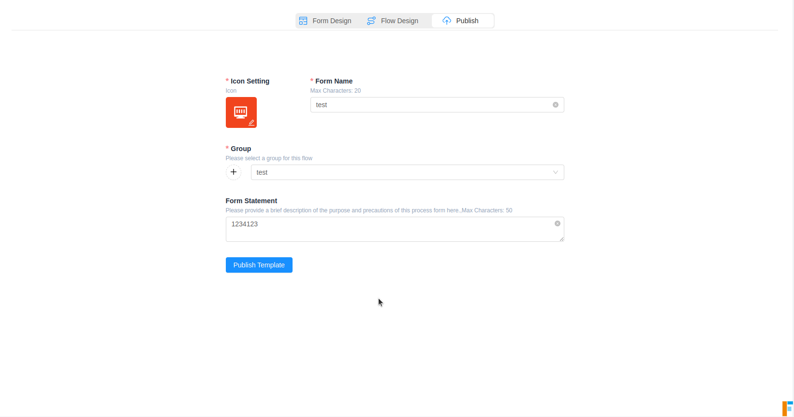
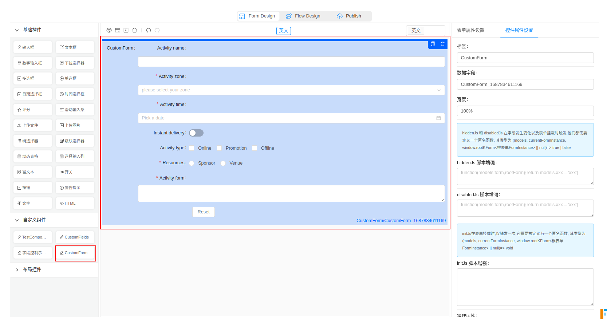

[toc]

# Laison-flowform

**表单设计**


**流程设计**


**模板发布**




----


# 

# FlowForm 业务系统集成

> 局域网文档 [地址](http://192.168.0.155:3200/Developer/)

工单系统为三方的业务系统提供了 `<iframe>` 的方式嵌入， 提供了以下页面以供访问：

| 页面名         | base path                       |
| -------------- | ------------------------------- |
| 模板与流程管理 | '/platform/flowformManagement'  |
| 我的发起       | '/platform/workorder/myapply'   |
| 我的代办       | '/platform/workorder/mytodo'    |
| 我的已办       | '/platform/workorder/mydone'    |
| 抄送我的       | '/platform/workorder/mycopied'  |
| 工单统计       | '/platform/workorder/statistic' |

本文档后面将把这些页面统称为 **业务页面**

这些页面的嵌入方式, 都是类似的。 依特定的要求，拼接好 URL ， 嵌入 `iframe` 标签即可。

**URL 拼接**

它们都需要以下特定 URL 参数， URL 分为四个部分:

1. **`FLOWFORM_PLATFORM_ADDRESS` (工单平台的部署 IP + 端口)**

   > 工单平台部署的地址， 如果是非复杂系统， 这里可以直接写在 `.env` 环境变量中， 例如本例中 将该地址存储为 `VUE_APP_FLOWFORM_ADDRESS` 环境变量

2. **basePath**

   指定页面的 基本路由

3. **必传 query 参数**

   - `uniTenantId` : 统一租户 ID
   - `bizToken`: 业务系统 授权 Token

4. **可选 query 参数**

   - `lang` ; 业务系统当前语言环境(不传递时，默认为 英文)

     > 工单系统本地语言支持 中英法葡萄牙以及阿拉伯五种语言， 对应的标识为：`[zh, en, fr, pt, ar]`

   - `recent` : 过滤查询条件 - 时间范围的默认值， 从现在开始，到起始时间 的间隔数(number 类型， 默认不填写为3, 时间单位为月)

   - `statsLevel` :

     用于统计页面，控制过滤结果的权限 ， 取值范围 [1,2,3] ， 默认为 3。

     - `1` : 起人 （发起人、查看全部的人)
     - `2` : 参与人 （发起人、参与人、查看全部的人)
     - `3` : 全部 (发起人、发起人部门及其子部门、参与人、查看全部的人)

**一个示例的 URL 如下：**

```bash
${FLOWFORM_PLATFORM_ADDRESS}${this.basePath}?uniTenantId=${UNI_TENANT_ID}&bizToken=${token}&lang=${lang}
```

以 `模板与流程管理` 页面为例: 某个业务系统中， 可以这样去集成:

```vue
<template>
  <iframe :src="src" frameborder="0"></iframe>
</template>
<script>
import { ACCESS_TOKEN } from '@/store/mutation-types';
import Vue from 'vue';
const token = Vue.ls.get(ACCESS_TOKEN);
const FLOWFORM_PLATFORM_ADDRESS = process.env.VUE_APP_FLOWFORM_ADDRESS;    
export default {
  data(){
    return{
      basePath:'/platform/flowformManagement'
    }
  },
  computed: {
    src: function () {
      const UNI_TENANT_ID = this.$store.state.user.info.sysDept.config.uniTenantId;
      const _lang = this.$store.state.user.info.language;
      const lang = _lang ? _lang.split('_')[0] : 'en';
      return `${FLOWFORM_PLATFORM_ADDRESS}${this.basePath}?uniTenantId=${UNI_TENANT_ID}&bizToken=${token}&lang=${lang}`;
    },
  },    
}
</script>
<style scoped>
iframe {
  width: 100%;
  height: calc(100vh - 134px);
  background: url('data:image/svg+xml;charset=utf-8,<svg xmlns="http://www.w3.org/2000/svg" width="32" height="32" viewBox="0 0 24 24"><path fill="none" stroke="currentColor" stroke-dasharray="15" stroke-dashoffset="15" stroke-linecap="round" stroke-width="2" d="M12 3C16.9706 3 21 7.02944 21 12"><animate fill="freeze" attributeName="stroke-dashoffset" dur="0.3s" values="15;0"/><animateTransform attributeName="transform" dur="0.5s" repeatCount="indefinite" type="rotate" values="0 12 12;360 12 12"/></path></svg>')
    0px 0px no-repeat;
  background-position: 50% 50%;
}
</style>
```

建议将公用的部分进行封装抽离:

```vue
<template>
  <iframe :src="src" frameborder="0"></iframe>
</template>
<script>
import handleIframeMixin from "@/mixins/handleIframeMixin.js"
export default {
  mixins: [handleIframeMixin],
  data(){
    return{
      basePath:'/platform/flowformManagement'
    }
  }
}
</script>
<style scoped>
@import '~@assets/style/iframBaseStyle.css';
</style>
```

## 模板与流程管理

1. **FLOWFORM_PLATFORM_ADDRESS** (工单平台的部署 IP + 端口)
2. **basePath ：** `/platform/flowformManagement`
3. 必填参数：
   1. `uniTenantId`
   2. `bizToken`
4. 可选参数：
   1. `lang`


## 我的发起

1. **FLOWFORM_PLATFORM_ADDRESS** (工单平台的部署 IP + 端口)
2. **basePath ：** `/platform/workorder/myapply`
3. 必填参数：
   1. `uniTenantId`
   2. `bizToken`
4. 可选参数：
   1. `lang`
   2. `recent` : 过滤条件，number 类型，过滤时间范围默认从当前到过去几个月(默认为3)。


## 我的代办

1. **FLOWFORM_PLATFORM_ADDRESS** (工单平台的部署 IP + 端口)
2. **basePath ：** `/platform/workorder/mytodo`
3. 必填参数：
   1. `uniTenantId`
   2. `bizToken`
4. 可选参数：
   1. `lang`


## 我的已办

1. **FLOWFORM_PLATFORM_ADDRESS** (工单平台的部署 IP + 端口)
2. **basePath ：** `/platform/workorder/mydone`
3. 必填参数：
   1. `uniTenantId`
   2. `bizToken`
4. 可选参数：
   1. `lang`


## 抄送我的

1. **FLOWFORM_PLATFORM_ADDRESS** (工单平台的部署 IP + 端口)
2. **basePath ：** `/platform/workorder/mycopied`
3. 必填参数：
   1. `uniTenantId`
   2. `bizToken`
4. 可选参数：
   1. `lang`


## 工单统计

1. **FLOWFORM_PLATFORM_ADDRESS** (工单平台的部署 IP + 端口)
2. **basePath ：** `/platform/workorder/statistic`
3. 必填参数：
   1. `uniTenantId`
   2. `bizToken`
4. 可选参数：
   1. `lang`
   2. `recent`
   3. `statsLevel`


---


# 扩展开发指南

对于开发人员，主要是对表单的扩展开发， 当基础的拖拽组件不满足业务需求时， 就需要开发自定义组件以满足需求。 自定义组件，从功能上分类，大致上可以分为**两类**:

1. 一类是普通字段录入组件，
2. 另一类是表单组件(也就是嵌套表单)。

对于这些组件的开发需要解决一些问题， 例如 普通的字段录入组件中的字段怎么在流程设计中，在流程节点上进行控制。 又或者 对于嵌套表单， 如何在提交时进行验证。 这些问题在下面的文档中会进行说明 。

所有的自定义组件，都暴露在: `src/CusComponents4FormDesign` 开发目录

创建一个自定义组件大致步骤：

1. 创建自定义组件目录

   ```bash
   mkdir src/CusComponents4FormDesign/CompomentName/
   ```

2. 创建 组件 以及导出出口文件

   ```bash
   touch src/CusComponents4FormDesign/CompomentName/CompomentName.vue index.js
   ```

3. 在自定义组件出口引入自定义组件，并统一导出

   > 在 src/CusComponents4FormDesign/index.js 中引入创建的组件，并导出

## 自定义组件 - 普通字段录入组件

### 定义普通字段录入组件示例

#### step1: 创建自定义组件目录和文件

```bash
mkdir src/CusComponents4FormDesign/CustomFields
touch src/CusComponents4FormDesign/CustomFields/CustomFields.vue index.js
```

#### step2: 导出和引入 组件

```js
// src/CusComponents4FormDesign/CustomFields/index.js 导入并包装
import CustomFields from './CustomFields.vue';
export default {
  label: 'CustomFields', // 标题文字
  icon: 'icon-write',
  component: CustomFields,
  type: 'CustomFields',
  options: {
    defaultValue: undefined
  },
};
```

> 导出字段详见 [自定义组件导出字段说明](http://192.168.0.155:3200/Developer/CustomCompExportConfig/)

```js
// src/CusComponents4FormDesign/index.js 导入到出口文件，并统一导出
import CustomFields from './CustomFields';
const cusComps = [];

cusComps.push(CustomFields);

export default cusComps;
```

#### step3: 开发并测试 自定义组件

**对于实际的自定义组件， 默认的将会有 `value` 和 `disabled` 两个 props 值。 所有的组件需要满足 能够被 `v-model` 指令绑定。** **组件的默认传入值为 `value`， 默认的传出事件名为 `change`。** **对于需要在流程结点控制权限的自定义字段， 你必须定义 `data.exposeFields` 对象**， 这个对象中， 有三个属性：

1. `value` : 字段绑定值
2. `disabled` ： 字段是否可编辑
3. `hidden` ： 字段是否可见

你需要分别监听 value, 和 exposeFields, 去触发初始值 set， 以及字段值变化，更新传出值逻辑。

```vue
// src/CusComponents4FormDesign/CustomFields/CustomFields.vue
<template>
  <div class="components-input-demo-presuffix">
    <a-input
      ref="userNameInput"
      v-model="exposeFields.userName.value"
      v-if="!exposeFields.userName.hidden"
      :disabled="disabled || exposeFields.userName.disabled"
      placeholder="Basic usage"
    >
      <a-icon slot="prefix" type="user" />
      <a-tooltip slot="suffix" title="Extra information">
        <a-icon type="info-circle" style="color: rgba(0, 0, 0, 0.45)" />
      </a-tooltip>
    </a-input>
    <br />
    <br />
    <a-input
      v-model="exposeFields.price.value"
      v-if="!exposeFields.price.hidden"
      :disabled="disabled || exposeFields.price.disabled"
      prefix="￥"
      suffix="RMB"
    />
  </div>
</template>

<script>
export default {
  name: 'exposeFields',
  props:['value','disabled'],
  data() {
    return {
      name: 'CustomFields',
      exposeFields: {
        userName: {
          value: '',
          disabled: false,
          hidden: false,
        },
        price: {
          value: '',
          disabled: false,
          hidden: false,
        },
      },
    };
  },
  watch:{
    value:{
      handler:function(){
        if(!this.value) return
        const { userName,price } = this.value
        this.exposeFields.userName.value = userName;
        this.exposeFields.price.value = price;
      },
      immediate:true,
      deep:true,
    },
    exposeFields:{
      handler:function(){
        const {userName,price} = this.exposeFields
        this.$emit("change",{userName:userName.value,price:price.value})
      },
      immediate:true,
      deep:true,
    }
  }
};
</script>
```

> 有几点值得注意:
>
> 1. set 初始值时，仅需要set exposedFields.xxx.value, 而不需要去管 hidden,和 disable, 他们是在其他地方被自动更新的
>
>    ```vue
>    value:{
>       handler:function(){
>         if(!this.value) return
>         const { userName,price } = this.value
>         this.exposeFields.userName.value = userName;
>         this.exposeFields.price.value = price;
>       },
>       immediate:true,
>       deep:true,
>     },
>    ```
>
> 2. 在向外 emit 更新值的时候， 仅需要 emit exposedFields.xxx.value, 同样不需要 hidden 和 disable, 因为这些配置将会被绑定在各个流程结点，所以这里是不需要的。
>
>    ```vue
>    exposeFields:{
>       handler:function(){
>         const {userName,price} = this.exposeFields
>         this.$emit("change",{userName:userName.value,price:price.value})
>       },
>       immediate:true,
>       deep:true,
>     }
>    ```
>
> 3. 在向外 emit 更新值的时候， exposeFields 这个 watcher, 需要开启 immediate:true, 否则, 当组件未手动触发时，可能会没有初始值
>
> 4. 该组件的值绑定类型， 就是 emit 出去的值类型
>
> 5. `hidden` 值要对应的绑定到 各个字段的 `v-if` 指令，用于控制是否可见
>
> 6. `disabled` 值的绑定则同时需要 `props.disable || exposedFields.xxx.disable`, 因为 `prop.disable` 控制了全局表单的可编辑状态， `exposedFields.xxx.disable`则被审批结点所控制。
>
> > 这些规则在后面的自定义表单组件同样适用

这样一个自定义组件就完成了。

你可以在这里看到自定义组件:


你可以在这里看到自定义组件的 v-model 值:


## 自定义组件 - 表单录入

定义一个能够被提交时验证的自定义组件， 和普通的字段录入自定义组件是类似的， 唯一的区别是你需要额外提供一个 名为 `validateCurrentForm` 的验证函数。

其他的部分则和 [自定义组件 - 普通字段录入组件](http://192.168.0.155:3200/Developer/CustomFields/) 中提及的保持一致，这里不再赘述。

唯一值得说明的是 `validateCurrentForm` 函数，应当返回一个 Promise, 并在该 Promise 中去完成当前表单的验证

```vue
<template>
  <a-form-model
    ref="ruleForm"
    :model="exposeFields"
    :rules="rules"
    :label-col="labelCol"
    :wrapper-col="wrapperCol"
  >
    <a-form-model-item
      v-if="!exposeFields.name.hidden"
      ref="name"
      label="Activity name"
      prop="name"
    >
      <a-input
        :disabled="disabled || exposeFields.name.disabled"
        v-model="exposeFields.name.value"
      />
    </a-form-model-item>
    <a-form-model-item
      v-if="!exposeFields.region.hidden"
      label="Activity zone"
      required
      prop="region"
    >
      <a-select
        :disabled="disabled || exposeFields.region.disabled"
        v-model="exposeFields.region.value"
        placeholder="please select your zone"
      >
        <a-select-option value="shanghai"> Zone one </a-select-option>
        <a-select-option value="beijing"> Zone two </a-select-option>
      </a-select>
    </a-form-model-item>
    <a-form-model-item
      v-if="!exposeFields.date1.hidden"
      label="Activity time"
      required
      prop="date1"
    >
      <a-date-picker
        :disabled="disabled || exposeFields.date1.disabled"
        v-model="exposeFields.date1.value"
        show-time
        type="date"
        placeholder="Pick a date"
        style="width: 100%"
      />
    </a-form-model-item>
    <a-form-model-item
      v-if="!exposeFields.delivery.hidden"
      label="Instant delivery"
      prop="delivery"
    >
      <a-switch
        :disabled="disabled || exposeFields.delivery.disabled"
        v-model="exposeFields.delivery.value"
      />
    </a-form-model-item>
    <a-form-model-item
      v-if="!exposeFields.type.hidden"
      label="Activity type"
      prop="type"
    >
      <a-checkbox-group
        :disabled="disabled || exposeFields.type.disabled"
        v-model="exposeFields.type.value"
      >
        <a-checkbox value="1" name="type"> Online </a-checkbox>
        <a-checkbox value="2" name="type"> Promotion </a-checkbox>
        <a-checkbox value="3" name="type"> Offline </a-checkbox>
      </a-checkbox-group>
    </a-form-model-item>
    <a-form-model-item
      v-if="!exposeFields.resource.hidden"
      :disabled="disabled || exposeFields.resource.disabled"
      label="Resources"
      required
      prop="resource"
    >
      <a-radio-group
        :disabled="disabled || exposeFields.type.disabled"
        v-model="exposeFields.resource.value"
      >
        <a-radio value="1"> Sponsor </a-radio>
        <a-radio value="2"> Venue </a-radio>
      </a-radio-group>
    </a-form-model-item>
    <a-form-model-item
      v-if="!exposeFields.desc.hidden"
      label="Activity form"
      required
      prop="desc"
    >
      <a-input
        :disabled="disabled || exposeFields.desc.disabled"
        v-model="exposeFields.desc.value"
        type="textarea"
      />
    </a-form-model-item>
    <a-form-model-item :wrapper-col="{ span: 14, offset: 4 }">
      <a-button style="margin-left: 10px" @click="resetForm"> Reset </a-button>
    </a-form-model-item>
  </a-form-model>
</template>
<script>
export default {
  props: ['value', 'disabled'],
  data() {
    return {
      labelCol: { span: 4 },
      wrapperCol: { span: 14 },
      other: '',
      exposeFields: {
        name: {
          value: '',
          disabled: false,
          hidden: false,
        },
        region: {
          value: undefined,
          disabled: false,
          hidden: false,
        },
        date1: {
          value: undefined,
          disabled: false,
          hidden: false,
        },
        delivery: {
          value: false,
          disabled: false,
          hidden: false,
        },
        type: {
          value: [],
          disabled: false,
          hidden: false,
        },
        resource: {
          value: '',
          disabled: false,
          hidden: false,
        },
        desc: {
          value: '',
          disabled: false,
          hidden: false,
        },
      },
      rules: {
        region: [
          {
            validator: (rule, { value }, cb) => {
              if (!value) {
                cb(new Error(`不可为空！`))
              } else {
                cb()
              }
            }
          }],
        date1: [
          {
            validator: (rule, { value }, cb) => {
              if (!value) {
                cb(new Error(`不可为空！`))
              } else {
                cb()
              }
            }
          }
        ],
        resource: [
          {
            validator: (rule, { value }, cb) => {
              if (!value) {
                cb(new Error(`不可为空！`))
              } else {
                cb()
              }
            }
          },
        ],
        desc: [{
          validator: (rule, { value }, cb) => {
            if (!value) {
              cb(new Error(`不可为空！`))
            } else {
              cb()
            }
          }
        }],
      },
    };
  },
  watch: {
    exposeFields: {
      handler: function () {
        const form = {};
        for (let i in this.exposeFields) {
          form[i] = this.exposeFields[i].value;
        }
        this.$emit("change", form)
      },
      immediate: true,
      deep: true
    },
    value: {
      handler: function () {
        if (!this.value) return
        for (let i in this.value) {
          this.exposeFields[i].value = this.value[i];
        }
      },
      immediate: true,
      deep: true
    }
  },

  methods: {

    resetForm() {
      this.$refs.ruleForm.resetFields();
    },

    /**
     * @description:
     */
    validateCurrentForm() {
      return new Promise((resolve, reject) => {
        if (this.$refs.ruleForm) {
          this.$refs.ruleForm.validate(valid => {
            if (valid) {
              resolve()
            } else {
              reject(err)
            }
          })
        }
      })
    },
  },
};
</script>
```




## 自定义组件导出字段说明

### [#](http://192.168.0.155:3200/Developer/CustomCompExportConfig/#label)label

- **类型：** `String`

- **是否必填：** 是

- **详细：**

  自定义组件显示名称

### [#](http://192.168.0.155:3200/Developer/CustomCompExportConfig/#icon)icon

- **类型：** `String`

- **是否必填：** 否

- **详细：**

  ant-design-icon 图表集 所支持的图标名

### [#](http://192.168.0.155:3200/Developer/CustomCompExportConfig/#component)component

- **类型：** `VueComponent`

- **是否必填：** 是

- **详细：**

  自定义组件

### [#](http://192.168.0.155:3200/Developer/CustomCompExportConfig/#type)type

- **类型：** `String`

- **是否必填：** 是

- **详细：**

  自定义组件类型，通常和组件名称保持一致

  组件渲染的时候,用于找到自定义组件,该字段名不可重复,且应该避免和 [预定义组件类型(见下方附录)](http://192.168.0.155:3200/Developer/CustomCompExportConfig/#) 的组件类型重名，否则不会展示自定义组件

### [#](http://192.168.0.155:3200/Developer/CustomCompExportConfig/#options)options

- **类型：** `String`

- **是否必填：** 否

- **详细：**

  控件的属性区域的配置

  该字段设定了 控件属性设置面板 将会有哪些配置项，可以按需扩展，但是需要在 src/lib/kform/KFormDesign/module/formItemProperties.vue 中去添加对应的字段。 这些字段也会被透传到自定义组件中

- 属性扩展

  options 选择中，你可以自定义传入 自定义组件的属性， 你可以在 `$attrs.options` 中访问到。

#### [#](http://192.168.0.155:3200/Developer/CustomCompExportConfig/#options-type)options.type

- **类型：** `String`

- **是否必填：** 否

- **详细：**

  该type 用于展示控件的属性区域的配置

  该type 用于展示控件的属性区域的配置 有大量的预定义属性输入控件,也可以按需自己增加,由于属性编辑是可被复用的,因此该字段是可以重复的, 如果 [预定义组件类型(见下方附录)](http://192.168.0.155:3200/Developer/CustomCompExportConfig/#) 中的类型所对应的组件配置足够你的自定义组件使用，那么你可以直接指定其中一个， 但是如果这些值无法满足你的需求时, 你应当自定义type, 并在 src/lib/kform/KFormDesign/module/formItemProperties.vue 中去预定义属性编辑输入控件, 并将值帮定到 options
  如果该字段未指定， 那么控件属性面板将会显示最基础的配置

#### [#](http://192.168.0.155:3200/Developer/CustomCompExportConfig/#options-width)options.width

- **类型：** `String`

- **是否必填：** 否

- **详细：**

  自定义组件的百分比宽度 默认值100%

#### [#](http://192.168.0.155:3200/Developer/CustomCompExportConfig/#options-defaultvalue)options.defaultValue

- **类型：** `String`

- **是否必填：** 否

- **详细：**

  组件的默认值 一般默认值是在自定义组件中去定义的。 如果需要在 属性控制设置 中去设定默认值， 则需要开启

#### [#](http://192.168.0.155:3200/Developer/CustomCompExportConfig/#options-placeholder)options.placeholder

- **类型：** `String`

- **是否必填：** 否

- **详细：**

  placeholder 仅在自定义组件最外层为 Input 元素时才会直接生效

#### [#](http://192.168.0.155:3200/Developer/CustomCompExportConfig/#options-clearable)options.clearable

- **类型：** `String`

- **是否必填：** 否

- **详细：**

  clearable 是否可清除 仅在自定义组件最外层为 Input 元素时才会直接生效

#### [#](http://192.168.0.155:3200/Developer/CustomCompExportConfig/#options-maxlength)options.maxLength

- **类型：** `String`

- **是否必填：** 否

- **详细：**

  maxLength 最大输入长度 仅在自定义组件最外层为 Input 元素时才会直接生效

#### [#](http://192.168.0.155:3200/Developer/CustomCompExportConfig/#options-minlength)options.minLength

- **类型：** `String`

- **是否必填：** 否

- **详细：**

  minLength 最小输入长度 仅在自定义组件最外层为 Input 元素时才会直接生效

#### [#](http://192.168.0.155:3200/Developer/CustomCompExportConfig/#options-addonbefore)options.addonBefore

- **类型：** `String`

- **是否必填：** 否

- **详细：**

  input 前缀 仅在自定义组件最外层为 Input 元素时才会直接生效

#### [#](http://192.168.0.155:3200/Developer/CustomCompExportConfig/#options-addonafter)options.addonAfter

- **类型：** `String`

- **是否必填：** 否

- **详细：**

  input 后缀 仅在自定义组件最外层为 Input 元素时才会直接生效

#### [#](http://192.168.0.155:3200/Developer/CustomCompExportConfig/#options-hidden)options.hidden

- **类型：** `String`

- **是否必填：** 否

- **详细：**

  组件是否可见 控制 控件属性设置面板 是否有 组件是否可见配置，如果设定为 false, 仅会控制表单默认是否可见， 流程结点配置将会不断的覆盖该设定

#### [#](http://192.168.0.155:3200/Developer/CustomCompExportConfig/#options-disabled)options.disabled

- **类型：** `String`

- **是否必填：** 否

- **详细：**

  组件是否可编辑 控制 控件属性设置面板 是否有 组件是否可编辑配置，如果设定为 false, 仅会控制表单默认是否可编辑， 流程结点配置将会不断的覆盖该设定

#### [#](http://192.168.0.155:3200/Developer/CustomCompExportConfig/#options-help)options.help

- **类型：** `String`

- **是否必填：** 否

- **详细：**

  组件帮助信息 控制 控件属性设置面板 是否有 帮助信息配置， 会在 lable 区域展示一个帮助的 图表，悬停将提示帮助信息。

#### [#](http://192.168.0.155:3200/Developer/CustomCompExportConfig/#options-rules)options.rules

- **类型：** `Array<{message:string,required:Boolean} | {pattern:REGXP, message:string]}>`

- **是否必填：** 否

- **详细：**

  验证规则 控制 控件属性设置面板 是否有 验证规则配置组件, 值类型为一个 数组 `[]`

**「附录」**

预定义组件类型

```bash
'input',
'textarea',
'date',
'time',
'number',
'radio',
'checkbox',
'select',
'rate',
'switch',
'slider',
'uploadImg',
'uploadFile',
'cascader',
'treeSelect',
'batch', 
'editor', 
'selectInputList',
'button', 
'alert', 
'text', 
'html', 
'divider'
```

## 获取当前语言环境

如果你需要获取当前语言环境， 可以通过`this.$attrs.lang` 获取

其返回值将是 `'zh' | 'en' | 'fr' | 'pt' | 'ar'`
